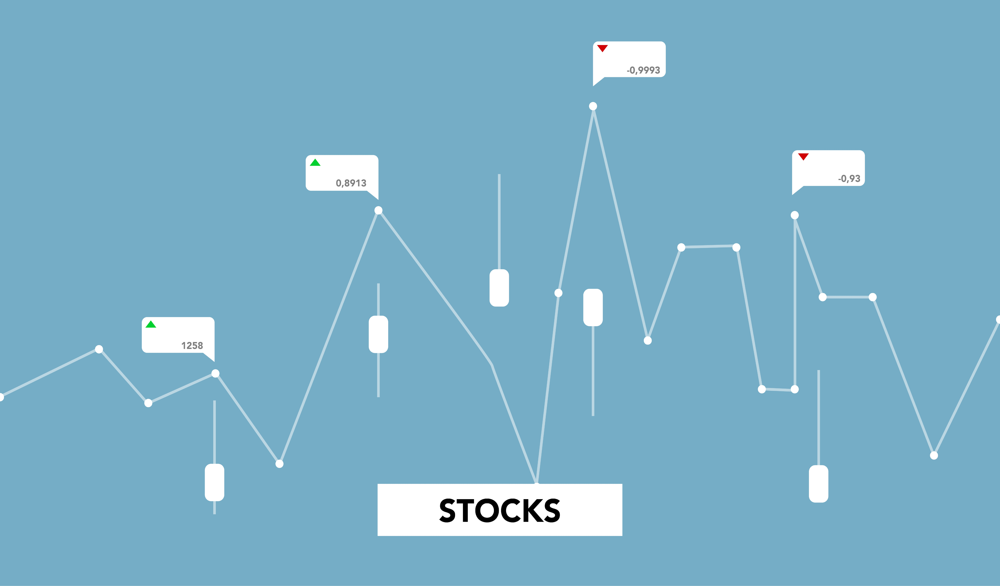

# Stock Market Dashboard

## Project Overview

Our project is designed to provide investors with comprehensive and up-to-date information on the top-performing stocks across various sectors like energy, materials, industrials, utilities, healthcare, financials, consumer goods, IT, communication, and real estate. We offer an interactive dashboard that presents daily open and close stock data, as well as a range of charts that reflect the day change, candlestick graphs, and heat maps based on the biggest stock movers per industry that allow users to easily visualize trends and identify potential investment opportunities. Our platform is user-friendly and intuitive, making it easy for investors of all levels to access the information they need to make informed decisions.

## Usage and Installation Instructions of Libraries/Tools

## Introduction 

Our project, **Stock-Success**, analyzes live data from Global Industry Classification Standard (GICS) stock market sectors. We chose to analyze two competing stocks from each major sector. On the dashboard, several interactive graphs allow users to pick up to two stocks from a dropdown menu and the accompanying data appears below. Widgets present the user with live news and stock market updates.

## Project Goals and How We Achieved Them

Our project aims to create an interactive stock market dashboard. End goals were determined over the course of two weeks. First, finding an API and creating a database to store data. By the end of week one, a Python Flask API had been implemented which returned data to the ```index.html``` file. During week two, the team focused on creating several visualizations: a line chart, candlestick, and OHLC. Once our initial end goals were met, our next focus was to make the dashboard as user-friendly as possible. A dark-mode setting was implemented, an additional drop-down menu was added which allows users to view just a single graph instead of two, and more widgets were added. Organization, effective time-management, and collaboration amongst the group allowed us to go beyond our anticipated goals.

## Data Processing/Gathering

The data was gathered from Yahoo Finance using the yfinance python library. For this project, we chose to analyze New York Stock Exchange OHLC data the past 5 years. We then had to specify which stocks/tickers we were looking to analyze. It was our goal to choose stocks in a uniform matter and to do this we chose the two stocks with the highest **volume** within each major sector. As seen in the table below, we had a total of 18 different stocks among 9 different sectors.

| Sector  | Stock (NYSE) |
| :------------- | :------------- |
| Energy  | Exxon Mobil Corporation (XOM)  |
| Energy  | Chevron Corporation (CVX)  |
| Materials  | The Sherwin-Williams Company (SHW)  |
| Materials  |  DuPont de Nemours, Inc. (DD)  |
| Industrials  | United Parcel Service, Inc. (UPS)  |
| Industrials  | Raytheon Technologies Corp (RTX)  |
| Utilities  | Duke Energy Corporation (DUK)  |
| Utilities  | Consolidated Edison, Inc. (ED)  |
| Healthcare  | Johnson & Johnson (JNJ)  |
| Healthcare  | Pfizer Inc. (PFE)  |
| Consumer Goods  | Amazon.com, Inc. (AMZN)  |
| Consumer Goods  | McDonald's Corporation (MCD)  |
| Consumer Defensive  | The Coca-Cola Company (KO)  |
| Consumer Defensive  | The Procter & Gamble Company (PG)  |
| Technology  | Apple Inc. (AAPL)  |
| Technology  | Microsoft Corporation (MSFT)  |
| Communication Services  | Alphabet Inc. (GOOG)  |
| Communication Services  | Meta Platforms, Inc. (META)  |  


The data was then cleaned and stored in a database using Pandas and SQLAlchemy. The data was then returned to the ```index.html``` file using a Python Flask API. The data was then used to create the visualizations using Plotly.

## Analysis and Modeling of our Visulizations/Findings

## Visuals and Explanation of our Dashboard

- Time Series Data (1-month, 6-month, and all-time)
- Interactive Charts (Candlestick Graphs, Heat Maps, Line Graphs )
- Open, High, Low, and Closing (OHLC) Data
- Ticker Ribbon with live stock prices
- Live News Feed
- Light/Dark Mode

## Additional Explanations

## Major Findings

## Limitations and Future Development

## Conclusion

From our data, we can conclude that the stock market was growing in 2019. In 2020, which coincides with COVID-19 pandemic, the stock market took a massive hit. That is not to say that all industries in the stock market were negatively affected, however. Healthcare giants J&J and Pfizer maintained stability during this period, whereas Exxon and Chevron shrunk due to travel restrictions, yielding an overall decrease in demand to do so. Most of our sample stocks appeared to recover after the pandemic (i.e. Consolidated Edison and Duke Energy), but ongoing government policies still play a role in the strength of various stocks. One example is the federal government’s decision to maintain a target interest rate in order to both help alleviate inflation and prevent another recession. 

## References

[Dark Mode Button](https://www.instagram.com/p/Cyi7GlctYBG/?utm_source=ig_web_copy_link&igshid=MzRlODBiNWFlZA%3D%3D&img_index=1)  
[Widget](https://www.tradingview.com/widget/)  
[Anime.js Header](https://www.sitepoint.com/get-started-anime-js/)
[Dark Theme](https://youtu.be/9LZGB3OLXNQ?si=gZ1M80J-NUNdJ3Lq)  
[Drop_Down Menu](Stackoverflow.com)  
[Forbes Stock Market Outlook](https://www.forbes.com/advisor/investing/stock-market-outlook-and-forecast/)  
Ted's Air Quality Example  
[Plotly Documentation](https://plotly.com/javascript/)    
[Animejs Documentation](https://animejs.com/)   
[Analysis with yfinance](https://thecleverprogrammer.com/2023/05/08/stock-market-performance-analysis-using-python/)

## Team Members

- [Uzma Sayyeda](https://github.com/UzmaSayyeda)  
- [Arnold Vincent](https://github.com/T800-101A)  
- [Maria Diosdado](https://github.com/mariadiosdado)  
- [Sullivan Shave](https://github.com/sullivanshave)  
