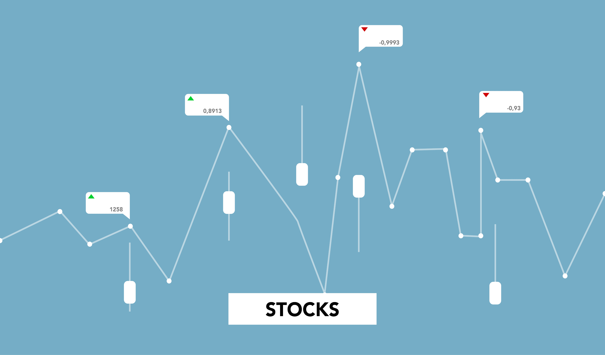

# Stock Market Dashboard

## Project Overview

Our project is designed to provide investors with comprehensive and up-to-date information on the top-performing stocks across various sectors like energy, materials, industrials, utilities, healthcare, financials, consumer goods, IT, communication, and real estate. We offer an interactive dashboard that presents daily open and close stock data, as well as a range of charts that reflect the day change, candlestick graphs, and heat maps based on the biggest stock movers per industry that allow users to easily visualize trends and identify potential investment opportunities. Our platform is user-friendly and intuitive, making it easy for investors of all levels to access the information they need to make informed decisions.

## Usage and Installation Instructions of Libraries/Tools

To run the dashboard, you will need to first install the following libraries locally:

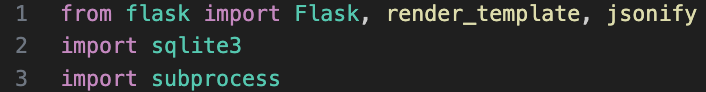

### Step 1: Clone the repository

### Step 2: Open the repository in VS Code

You should see the following project contents:

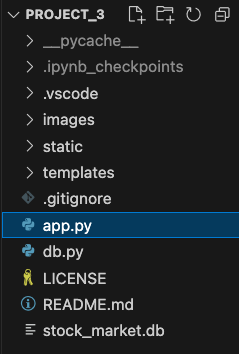

### Step 3: Select the ```app.py``` file and open a new terminal window

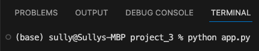

### Step 4: Run the following command in the terminal window: ```python app.py```

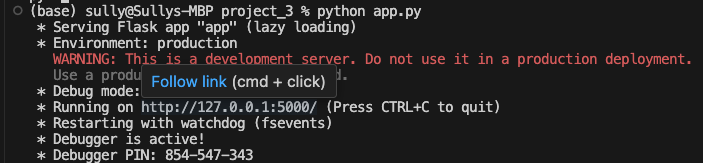

### Step 5: Follow the link provided in the terminal window and the dashboard will open in your browser.

## Introduction 

Our project, **Stock-Success**, analyzes live data from Global Industry Classification Standard (GICS) stock market sectors. We chose to analyze two competing stocks from each major sector. On the dashboard, several interactive graphs allow users to pick up to two stocks from a dropdown menu and the accompanying data appears below. Widgets present the user with live news and stock market updates.

## Project Goals and How We Achieved Them

Our project aims to create an interactive stock market dashboard. End goals were determined over the course of two weeks. First, finding an API and creating a database to store data. By the end of week one, a Python Flask API had been implemented which returned data to the ```index.html``` file. During week two, the team focused on creating several visualizations: a line chart, candlestick, and OHLC. Once our initial end goals were met, our next focus was to make the dashboard as user-friendly as possible. A dark-mode setting was implemented, an additional drop-down menu was added which allows users to view just a single graph instead of two, and more widgets were added. Organization, effective time-management, and collaboration amongst the group allowed us to go beyond our anticipated goals.

## Data Processing/Gathering

The data was gathered from Yahoo Finance using the yfinance python library. For this project, we chose to analyze New York Stock Exchange OHLC data the past 5 years. We then had to specify which stocks/tickers we were looking to analyze. It was our goal to choose stocks in a uniform matter and to do this we chose the two stocks with the highest **volume** within each major sector. As seen in the table below, we had a total of 18 different stocks among 9 different sectors.

| Sector  | Stock (NYSE) |
| :------------- | :------------- |
| Energy  | Exxon Mobil Corporation (XOM)  |
| Energy  | Chevron Corporation (CVX)  |
| Materials  | The Sherwin-Williams Company (SHW)  |
| Materials  |  DuPont de Nemours, Inc. (DD)  |
| Industrials  | United Parcel Service, Inc. (UPS)  |
| Industrials  | Raytheon Technologies Corp (RTX)  |
| Utilities  | Duke Energy Corporation (DUK)  |
| Utilities  | Consolidated Edison, Inc. (ED)  |
| Healthcare  | Johnson & Johnson (JNJ)  |
| Healthcare  | Pfizer Inc. (PFE)  |
| Consumer Goods  | Amazon.com, Inc. (AMZN)  |
| Consumer Goods  | McDonald's Corporation (MCD)  |
| Consumer Defensive  | The Coca-Cola Company (KO)  |
| Consumer Defensive  | The Procter & Gamble Company (PG)  |
| Technology  | Apple Inc. (AAPL)  |
| Technology  | Microsoft Corporation (MSFT)  |
| Communication Services  | Alphabet Inc. (GOOG)  |
| Communication Services  | Meta Platforms, Inc. (META)  |  


The data was then cleaned and stored in a database using Pandas and SQLAlchemy. The data was then returned to the ```index.html``` file using a Python Flask API. The data was then used to create the visualizations using Plotly.

## Visuals and Explanation of our Dashboard

- Time Series Data (1-month, 6-month, and all-time)
- Interactive Charts (Candlestick Graphs, Heat Maps, Line Graphs )
- Open, High, Low, and Closing (OHLC) Data
- Ticker Ribbon with live stock prices
- Live News Feed
- Light/Dark Mode

## Analysis and Modeling of our Visulizations/Findings

#### Front Page of Dashboard

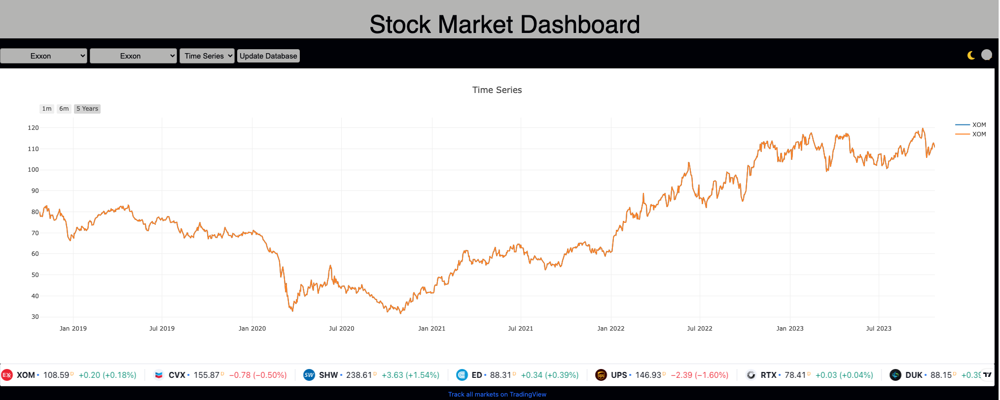

#### Time Series of Two Different Stocks

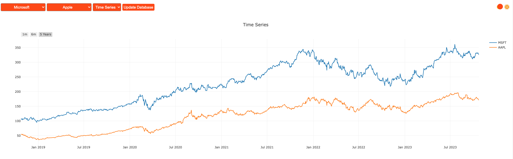

#### Candlestick Graphs with Interactive Timeline

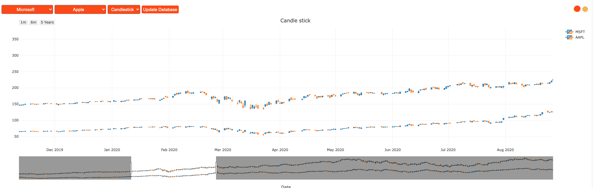

#### Time Series with OHLC Data

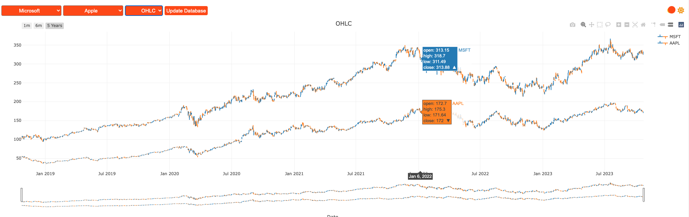

#### Plotly Tools for Our Visualizations

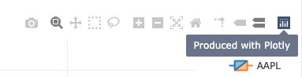

#### Overview of Widgets that Provide Live News and Stock Market Updates

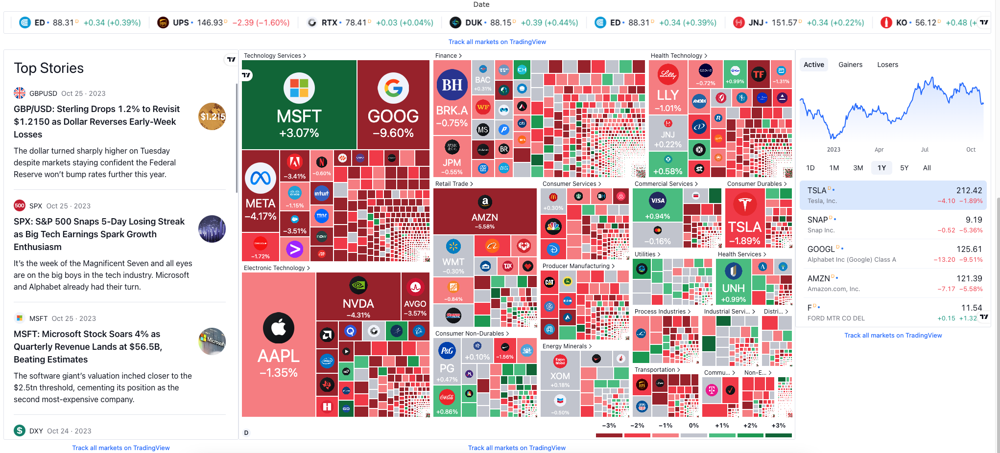

## Limitations and Future Development

#### Challenges

Throughout the course of the project, we encountered several challenges and limitations. The first was choosing which data source to use. We had initially intended on using the **Polygon.io API**, but we soon realized that the complexity this API entails was not realistic for our two week deadline. Thus, we opted for the **yfinance** library, which is Python-based, free to use, and simple to use. With that being said, however, we recognize the potential benefits that Polygon.io could provide us, especially for more complex or professional applications. Its real-time data, extensive coverage, and highly-specific data would provide us valuable features for future iterations of our project, especially as our application grows and requires more advanced functionalities.

Another challenge we faced was the data retrieval via Flask API. It was a laborious task to retrieve specific data based on the ticker symbol from the SQLite database and to return the data in a format that our front-end could easily interpret and display. In the beginning, we had a list of tuples giving us more problems at the time of accessing directly into the columns and rows from the data. Despite this challenge, our solution was to implement a Flask route, `/api/data/<ticker>`, that responds to GET requests related to a specific ticker symbol. The data is fetched from a SQLite database, converted into a list of dictionaries with column names as keys, and then returned as JSON using Flask's jsonify function. Our JavaScript code then fetches this data and uses it to render the appropriate chart using Plotly.

Furthermore, we struggled with the drop-down selection of tickers as well as viewing the graph of only a single ticker. By leveraging JavaScript event listeners and manipulating DOM, we were able to create a dynamic drop down menu that updates the view based on the user's selection, ultimately creating a change event when the data is fetched at the Flask endpoint. This allowed us to render different types of charts (Time Series, Candlestick, OHLC) based on the user's input by Maping the x and y field of the trace objects.

#### Limitations

Our limitations at this point revolve around the dark-mode of the graphs, limited metrics, and the overall security. We understand that users might need more detailed information for their analysis, yet our dashboard only provides a limited set of metrics. We can add functionality into our dashboard by including more metrics, such as volume data, moving averages, and technical indicators. In terms of security, our dashboard does not provide any user authentication or authorization mechanisms. For this, we can add extra functionality to provide personalized experiences and to improve the security of our application.

#### Future Development

As of now, our dashboard is running in a local environment. We look to deploy our dashboard to the cloud, so that users can access it from anywhere at any time via platforms like AWS, Google Cloud, etc. To enhance the user experience, we have started using the **Anime.js** library for animations. In the future, to add more interactive and engaging animations to our web application we can utilize more css edition or other libraries.

We will continue to refine our database updating process to ensure our data remains current and accurate.Currently, we show a "loading" indicator during updates to provide feedback to the user, same as once the update is completed a popup box is shown. We look to improve this by having the latest data loaded at the time of refresh.

## Conclusion

From our data, we can conclude that the stock market was growing in 2019. In 2020, which coincides with COVID-19 pandemic, the stock market took a massive hit. That is not to say that all industries in the stock market were negatively affected, however. Healthcare giants J&J and Pfizer maintained stability during this period, whereas Exxon and Chevron shrunk due to travel restrictions, yielding an overall decrease in demand to do so. Most of our sample stocks appeared to recover after the pandemic (i.e. Consolidated Edison and Duke Energy), but ongoing government policies still play a role in the strength of various stocks. One example is the federal government’s decision to maintain a target interest rate in order to both help alleviate inflation and prevent another recession. 

## References

[Dark Mode Button](https://www.instagram.com/p/Cyi7GlctYBG/?utm_source=ig_web_copy_link&igshid=MzRlODBiNWFlZA%3D%3D&img_index=1)  
[Widget](https://www.tradingview.com/widget/)  
[Anime.js Header](https://www.sitepoint.com/get-started-anime-js/)
[Dark Theme](https://youtu.be/9LZGB3OLXNQ?si=gZ1M80J-NUNdJ3Lq)  
[Drop_Down Menu](Stackoverflow.com)  
[Forbes Stock Market Outlook](https://www.forbes.com/advisor/investing/stock-market-outlook-and-forecast/)  
Ted's Air Quality Example  
[Plotly Documentation](https://plotly.com/javascript/)    
[Animejs Documentation](https://animejs.com/)   
[Analysis with yfinance](https://thecleverprogrammer.com/2023/05/08/stock-market-performance-analysis-using-python/)

## Team Members

- [Uzma Sayyeda](https://github.com/UzmaSayyeda)  
- [Arnold Vincent](https://github.com/T800-101A)  
- [Maria Diosdado](https://github.com/mariadiosdado)  
- [Sullivan Shave](https://github.com/sullivanshave)  
